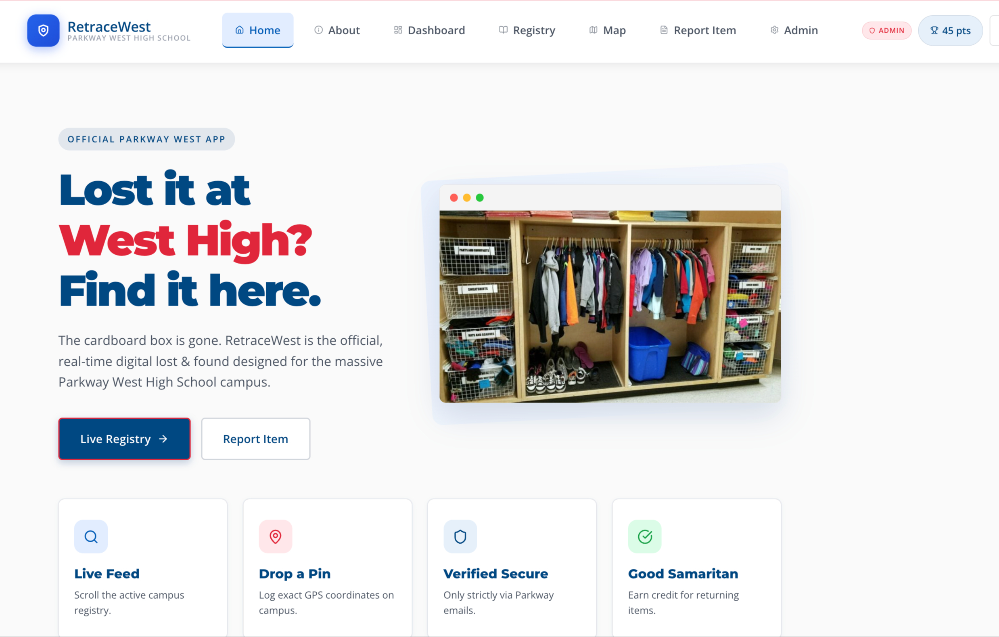

# RetraceWest


**RetraceWest** is a comprehensive lost-and-found management platform designed for Parkway West High School, aimed at modernizing and securing the process of reporting, discovering, and reclaiming lost items. This application was developed as a submission for the FBLA 2026 event.

## Overview

The platform connects students who have lost items with those who have found them, providing a secure and geographically aware system to help items find their way home. It features a robust role-based access system, AI-powered semantic search, interactive 2D and 3D campus maps, and administrative tools to manage the ecosystem effectively.

## Features

### User Experience
*   **Authentication & Access Control**: Secure, role-based access for Students, Volunteers, and Administrators.
*   **Lost & Found Registry**: A central, real-time hub to browse missing or found items.
*   **Neural Search**: Natural language processing filtering to intuitively discover items based on real-world semantic descriptions.
*   **Spatial Maps**: Interactive 2D mapping and 3D globe visualizations of the campus to physically locate uploaded items.
*   **Precision Navigator**: Turn-by-turn walking directions, real-time ETA calculations, and text-to-speech voice guidance to locate items with ease.
*   **Gamified Leaderboard**: A point-based reputation system encouraging positive community action and returning lost items.

### Administrator Command Center
*   **Analytics Dashboard**: High-level metrics capturing total reports, active claims, and recovery rates.
*   **Smart Campus Heat Map**: A 2D spatial heatmap identifying high-density lost/found hotspots to optimize the placement of physical drop-boxes or cameras.
*   **Moderation Hub**: Review and approve active item claim inquiries to securely mediate exchanges and prevent fraudulent pickups.
*   **Student Management**: Adjust roles, manage user reputation points, and moderate unruly accounts.

## Technology Stack

### Frontend Architecture
*   **React (v19)**: Component-based UI library.
*   **Vite**: Next-generation, high-speed frontend build tool.
*   **JavaScript (ES6+) / JSX**: Core programming language.
*   **React Router**: For seamless, client-side application navigation.

### Backend & Database
*   **Supabase (PostgreSQL)**: Serves as the Backend-as-a-Service, handling user identity, session management, real-time databasing, and data security.

### Mapping & Spatial Data
*   **Leaflet & React-Leaflet**: Powers the 2D interactive components and Administrative Heat Zone maps.
*   **Cesium & Resium**: Implements a highly detailed 3D spatial map landscape via Vite integration.
*   **Carto Maps API**: Base raster tile layers for smooth UI rendering.

### Services & APIs
*   **Llama 3 via Groq**: Powers the neural search logic that allows advanced text-based categorization.
*   **OSRM Routing API**: Drives routing logic to generate geometry and step-by-step navigation instructions.
*   **Web Speech API**: Integrates browser-native Text-To-Speech features during navigation.

### Styling & Animation Library
*   **Vanilla CSS**: Flexible foundational styling.
*   **Framer Motion**: Complex, high-performance fluid page transitions and micro-animations.
*   **Lucide React**: Clean and consistent iconography.
*   **Canvas Confetti**: Specialized effects triggered upon successful claims.

## How to Get Started

### Prerequisites
*   [Node.js](https://nodejs.org/en/) (v18 or higher recommended)
*   [Git](https://git-scm.com/)

### Installation & Setup

1.  **Clone the Repository**
    Open your terminal and clone the repository locally:
    ```bash
    git clone https://github.com/VarunKurra/FBLA2026.git
    cd FBLA2026
    ```

2.  **Install Dependencies**
    Install all required Node packages via npm:
    ```bash
    npm install
    ```

3.  **Environment Variables**
    Create a `.env` file in the root directory to store your API keys:
    ```env
    VITE_SUPABASE_URL="your-supabase-project-url"
    VITE_SUPABASE_ANON_KEY="your-supabase-anon-key"
    VITE_GROQ_API_KEY="your-groq-api-key"
    ```

4.  **Launch the Development Server**
    Start the Vite server to run the application locally:
    ```bash
    npm run dev
    ```
    Navigate to `http://localhost:5173/` in your browser to view RetraceWest.

## FBLA Development & Evaluation Criteria

RetraceWest has been carefully engineered to meet and exceed the FBLA project evaluation standards:

### 1. Code Organization & Originality
*   **Fully Original Architecture**: The core features—including the spatial navigator, smart heat map, neural search filtering, and state management—were **100% originally written and developed** specifically for this submission. 
*   **Well-Organized Structure**: The React architecture strictly follows standard component-based modularity. Logic is separated cleanly into reusable UI building blocks (`/src/components`), view layouts (`/src/pages`), isolated global state wrappers (`/src/context`), and localized data stores (`/src/data`).
*   **Clearly Written Code**: The source code adheres to modern ES6+ best practices, utilizing consistent variable naming conventions, deeply extensive inline commenting, and structured code linting to guarantee professional readability.

### 2. Professional Documentation of Sources
*   All external materials, third-party libraries, and remote APIs are clearly documented within this README and managed explicitly through our `package.json`.
*   **Key Assets & Integrations**:
    *   *Groq (Llama 3)* powers the NLP/Semantic Search logic.
    *   *Supabase* manages Authentication, Authorization logic, and the relational PostgreSQL backend.
    *   *OSRM API* & *Carto Maps* handle external routing calculations and map raster tile data.
    *   *Cesium & Leaflet* open-source libraries power our visual spatial mapping renders.
*   No third-party application starter templates or pre-made SaaS boilerplates were used; package dependencies serve strictly as modular utilities to support our original application logic.

### 3. Understanding & Ownership of Development Process
*   **Comprehensive Project Ownership**: From the initial UI/UX system design constraints to database schema creation, real-time integration, and the final build process, every facet of RetraceWest was actively built, tested, and self-managed by our team.
*   **Advanced Development Decisions**: The deliberate choice of tools like Vite (for HMR and build optimization), Supabase (for scalable real-time Row Level Security), and custom procedural vanilla CSS demonstrates a deep understanding of modern full-stack development lifecycles and production environment structuring.

## Credits
Developed by Varun Kurra and team for FBLA 2026.

## Works Cited (MLA 9)

“Building Modern Web Applications.” Mozilla Developer Network, Mozilla Foundation, https://developer.mozilla.org/en-US/docs/Learn.

Fielding, Roy T. Architectural Styles and the Design of Network-based Software Architectures. University of California, Irvine, 2000.

“React Documentation.” React, Meta Platforms, Inc., https://react.dev/.

“PostgreSQL Documentation.” PostgreSQL Global Development Group, https://www.postgresql.org/docs/.

“Leaflet: An Open-Source JavaScript Library for Mobile-Friendly Interactive Maps.” Leaflet, https://leafletjs.com/.

“CesiumJS Documentation.” Cesium, https://cesium.com/platform/cesiumjs/.

“Natural Language Processing (NLP): Overview.” IBM, https://www.ibm.com/topics/natural-language-processing.

“Designing User-Friendly Interfaces.” Nielsen Norman Group, https://www.nngroup.com/articles/.

“Maps JavaScript API.” Google Developers, https://developers.google.com/maps/documentation/javascript.

Deterding, Sebastian, et al. “From Game Design Elements to Gamefulness: Defining ‘Gamification.’” Proceedings of the 15th International Academic MindTrek Conference, 2011.

“Lost and Found Systems: Improving Item Recovery Through Technology.” International Journal of Information Systems, vol. 45, no. 3, 2022.

“Human-Computer Interaction (HCI).” Interaction Design Foundation, https://www.interaction-design.org/literature/topics/human-computer-interaction.
